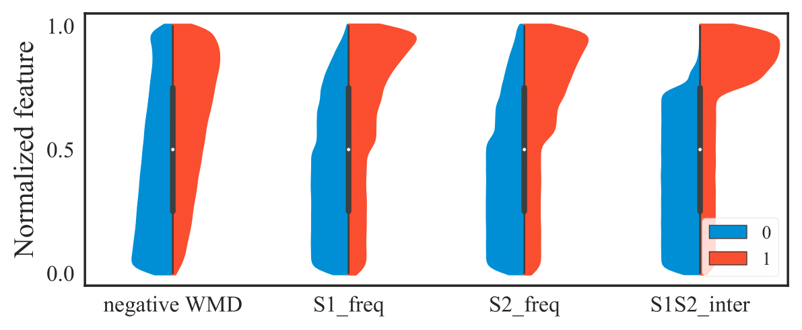
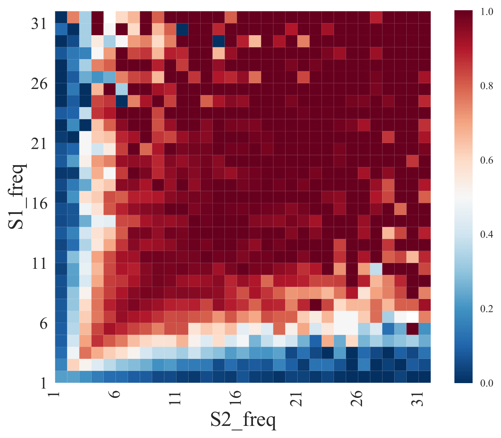
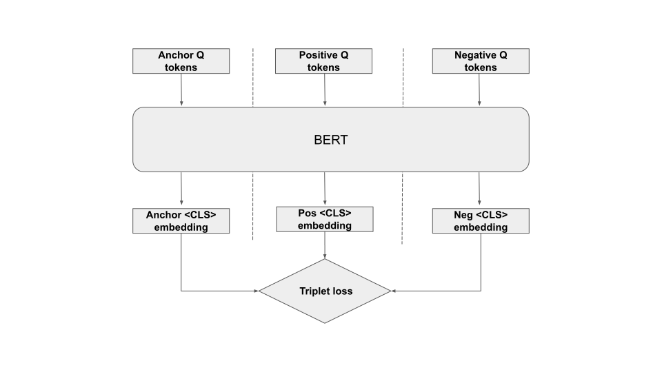
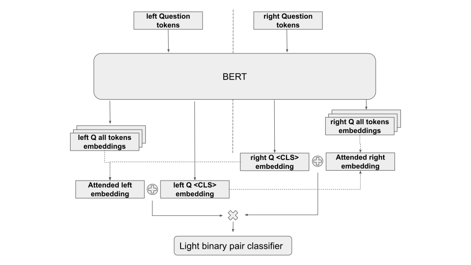

#Competition
**Quora question pairs**

https://www.kaggle.com/c/quora-question-pairs

# Main solution

**Key moments:**
* It's unacceptable to make classification on all pairs with such heavy classifier as BERT in real life. I would use BERT to get good encodings for questions.
* Train dataset has [selection bias](https://arxiv.org/abs/1905.06221), seems private set also has this issue. I prefer not to use these leakage features to improve the score. But such train
dataset leads to overfitting problem, which's still unresolved by me.
  
* To make BERT \<CLS\> encodings more suitable for final task I try to finetune them with metric learning on triplets. Also this procedure helps with selection bias problem in case of good triplet generator.
* Token embeddings are also important to train a good model. To save information from not \<CLS\> tokens I use classifier head with extra input: sum of all token embeddings attended to other question.

**Requirements**
- check `requirements.txt` and install missing packages
- download a pre-trained BERT model and place it in this folder, specify the chosen model in `config.yml` (`path_to_pretrained_model`). For example, for a medium uncased model that will be: 
- `wget -q https://storage.googleapis.com/bert_models/2018_10_18/uncased_L-12_H-768_A-12.zip'`
- `unzip uncased_L-12_H-768_A-12.zip`
- place your CSV files in the input folder (`path_to_data` in `models/bert_finetuning/config.yml`)
- specify batch size in `models/bert_finetuning/config.yml` and `models/bert_finetuning/config_triplets.yml`:
- install apex or change `apex_mixed_precision` to `False`

**Run whole training process and get submission file**
```
python submission.py
```
## Phase 1: Metric Learning

### Create triplet dataset from question pairs
**[notebook](notebooks/bert_finetuning/0_0_data_preprocessing_triplets.ipynb)**

* split train pair dataset with stratification on `train.csv` data (validation part = 0.1)
* build positive and negative connection graphs on train set 
* collect buckets with duplicated questions
* detect all negative connections from each bucket to other buckets 
* generate triplets: for each pair of questions in bucket - 3 negative examples
 

### Train metric learning   

**[notebook](notebooks/bert_finetuning/0_1_bert_metric_learning_triplet_loss.ipynb)**

* encode anchor, positive and negative questions from triplet with BERT separately
* train with [Triplet Loss](https://arxiv.org/abs/1412.6622) for 3 encoded \<CLS\> tokens respectively



## Phase 2: Pair classifier

**[notebook](notebooks/bert_finetuning/0_2_bert_finetuning_pair_clf_inner_prod_attention_with_metric_learning.ipynb)**

* split train pair dataset in same way as for metric learning to reduce data leak
* load metric learned encoder BERT encoder
* encode left and right question with BERT separately
* pool all encoded tokens from one question attended to encoded \<CLS\> token of another question
* concat attended embedding with \<CLS>\ embedding for each question
* get elementwise product of question embedding
* make binary classification with 2-layer classifier's head


